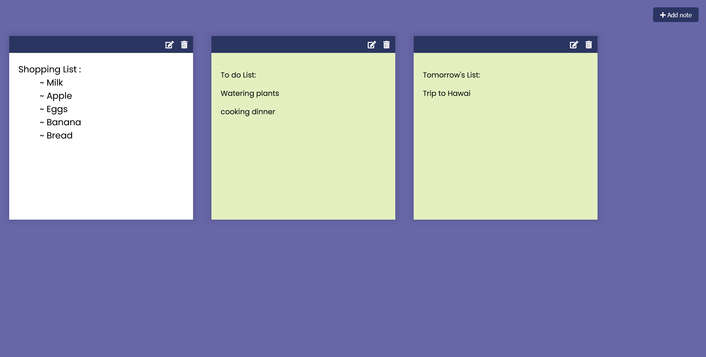

<h1 align = "center"><b>Notes App</b></h1>

    <a href="https://notes-app-sahadcmd.vercel.app/" target="_blank">Visit Website</a>
    ·
    <a href="https://github.com/sahadcmd/Notes-App/issues" target="_blank">Report Bug</a>
    ·
    <a href="https://github.com/sahadcmd/Notes-App/issues" target="_blank">Request Feature</a>

The notes app is a user-friendly tool that allows you to effortlessly capture and organize your thoughts, ideas, and reminders. With its intuitive interface, you can easily create, edit, and delete notes, ensuring that you never miss an important piece of information. Stay organized and stay productive with the notes app at your fingertips.

## Preview

    

 

<h5 align="center">Connect with me!</h5>

    

